# 🎲 Mikael Petriw

Me chamo Mikael Petriw, tenho 21 nascido em Curitiba, estudante de **Análise e Desenvolvimento de Sistemas** na UNIFAPI.

Atualmente dedico meu tempo a consolidar e fortalecer minha base em Lógica de Programação e Algoritmos, desenvolvendo e exploroando minhas ideias utilizando Java e C, enquanto me aventuro no ecossistema Web com PHP, JavaScript, HTML e CSS.

 **Fun Facts:**
* Inglês nível **Intermediário Superior (B2)**.
* Sou um grande entusiasta de **RPG** e **Game Design**.
* Uso meus hobbies para exercitar o pensamento sistêmico e a criação de mecânicas.
* Pretendo trabalhar como **GameDev** futuramente.

---

### 🤖 Linguagens e Tecnologias

 
 

### 📊 Estatísticas

  

